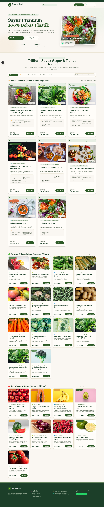

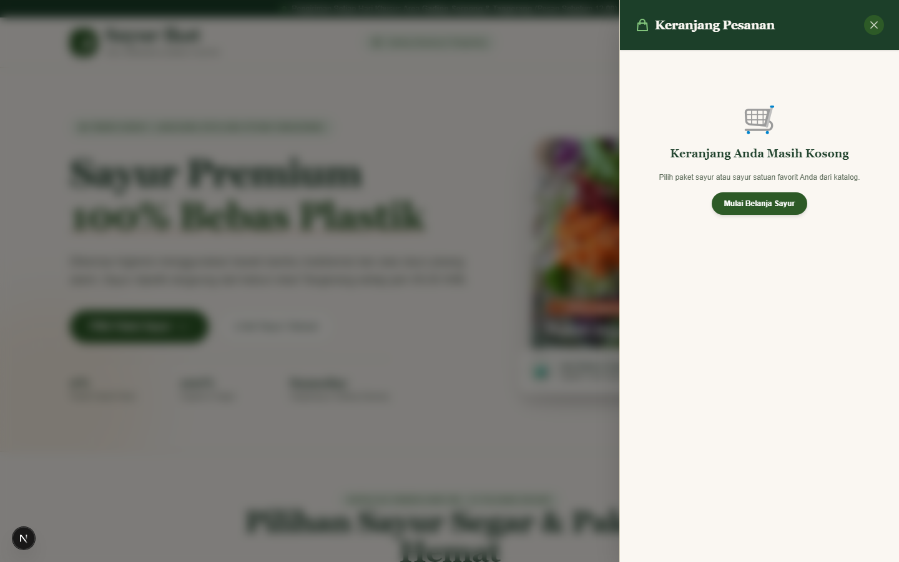
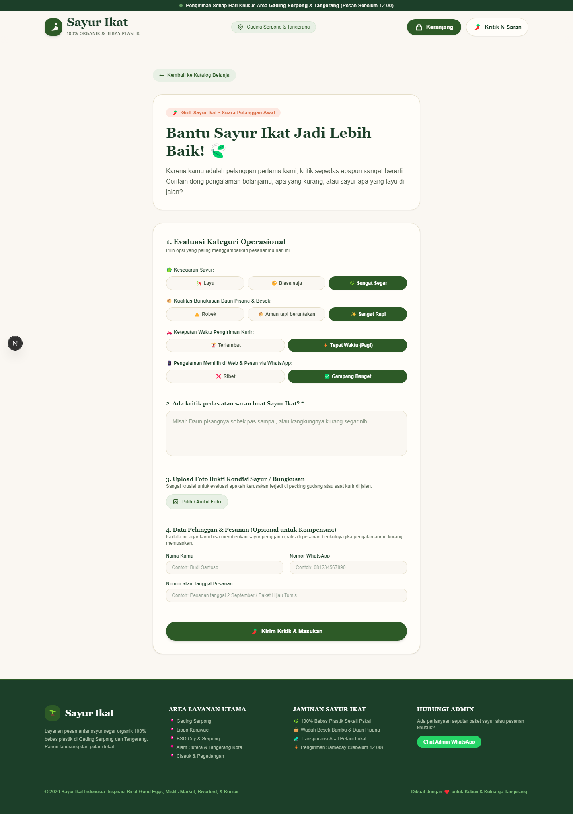
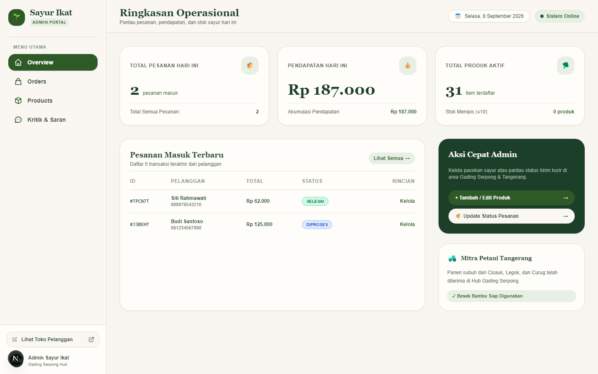
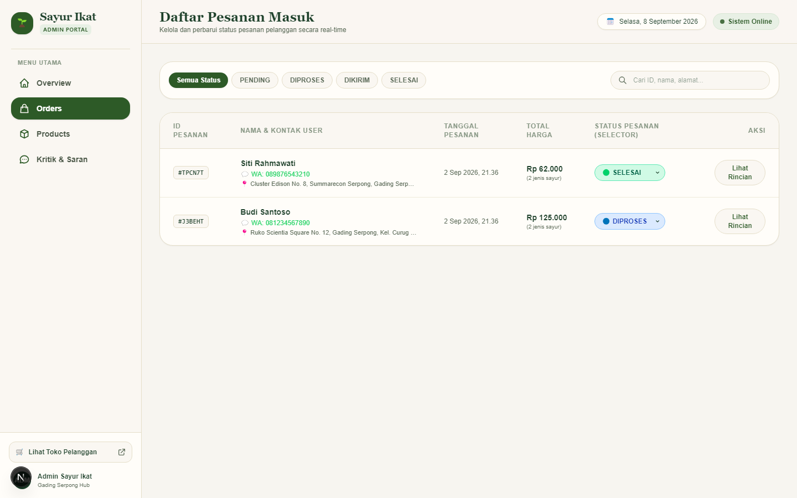
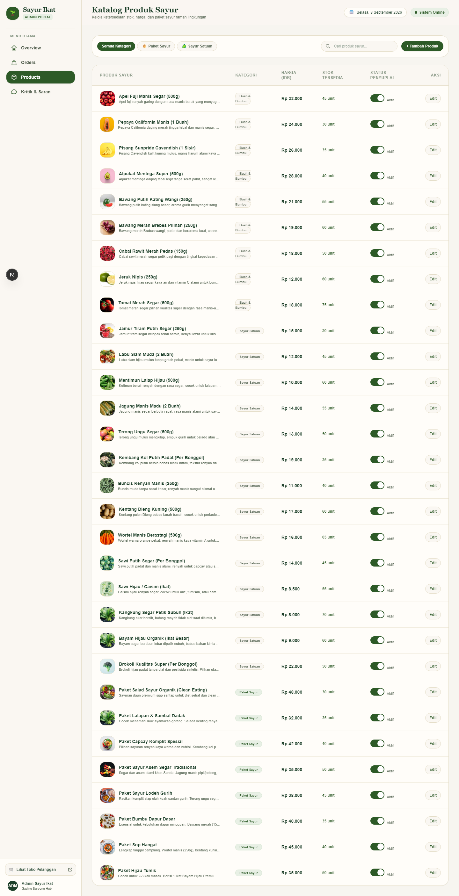
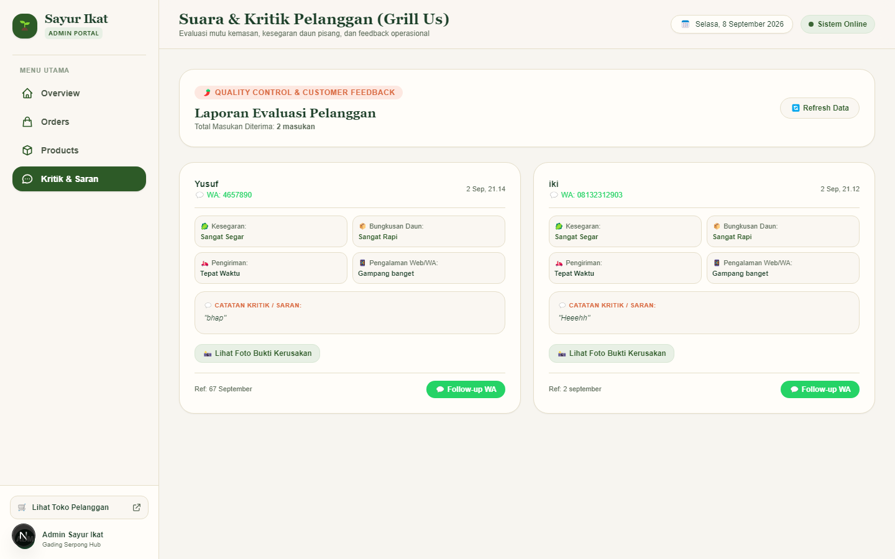

# Panduan Pengguna — Sayur Ikat

Panduan ini disusun berdasarkan screenshot aplikasi web **Sayur Ikat** (belanja sayur organik & bebas plastik untuk area Gading Serpong & Tangerang).

Semua gambar ada di folder [`screenshots/`](./screenshots/).

---

## Daftar isi

1. [Ringkasan aplikasi](#1-ringkasan-aplikasi)
2. [Panduan pelanggan](#2-panduan-pelanggan)
3. [Panduan admin](#3-panduan-admin)
4. [Daftar halaman & screenshot](#4-daftar-halaman--screenshot)

---

## 1. Ringkasan aplikasi

| Peran | Halaman utama | Fungsi |
| --- | --- | --- |
| Pelanggan | `/` | Lihat katalog, isi keranjang, checkout via WhatsApp |
| Pelanggan | `/feedback` | Kirim kritik & saran (rating + foto + data opsional) |
| Admin | `/admin` | Ringkasan operasional hari ini |
| Admin | `/admin/orders` | Kelola status pesanan |
| Admin | `/admin/products` | Kelola katalog & stok |
| Admin | `/admin/feedback` | Baca masukan pelanggan & follow-up WA |

**Catatan layanan:** pengiriman khusus **Gading Serpong & Tangerang**; pesan sebelum jam **12.00** untuk pengiriman harian.

---

## 2. Panduan pelanggan

### 2.1 Beranda & katalog



**Cara pakai:**

1. Buka beranda (`/`).
2. Baca banner pengiriman di atas header.
3. Klik **Pilih Paket Sayur** untuk scroll ke katalog, atau **Lihat Sayur Satuan**.
4. Filter produk lewat tab kategori, misalnya:
   - Semua Produk
   - Paket Sayur
   - Sayur Hijau / Sayur Satuan
   - Buah & Bumbu
5. Klik tombol **+ Keranjang** / **Tambah ke Keranjang** pada produk yang diinginkan.

**Tampilan mobile:**



---

### 2.2 Keranjang & checkout WhatsApp



**Membuka keranjang**

1. Klik tombol hijau **Keranjang** di header.
2. Drawer **Keranjang Pesanan** terbuka dari kanan.

**Jika keranjang kosong**

- Muncul pesan *Keranjang Anda Masih Kosong*.
- Klik **Mulai Belanja Sayur** atau tutup dengan **X**, lalu pilih produk di katalog.

**Jika sudah ada item**

1. Sesuaikan jumlah dengan tombol **−** / **+**, atau hapus item.
2. Isi data pengiriman (wajib):
   - Nama lengkap
   - Nomor WhatsApp
   - Alamat lengkap (Tangerang / Serpong)
3. Isi catatan pesanan (opsional).
4. Cek subtotal + ongkir, lalu lanjut checkout.
5. Aplikasi membuka **WhatsApp** dengan pesan pesanan siap kirim ke admin.
6. Setelah redirect, keranjang biasanya dikosongkan otomatis.

---

### 2.3 Kritik & saran



**Cara kirim feedback:**

1. Dari header, klik **Kritik & Saran**, atau buka `/feedback`.
2. (Opsional) klik **← Kembali ke Katalog Belanja** jika ingin kembali belanja.
3. Isi **Evaluasi kategori operasional**:
   - Kesegaran sayur
   - Kualitas bungkusan daun pisang & besek
   - Ketepatan waktu kurir
   - Pengalaman web & WhatsApp
4. Tulis kritik/saran di kolom teks terbuka (wajib).
5. Upload foto bukti (opsional, maks. 5MB).
6. Isi data pelanggan & nomor/tanggal pesanan (opsional, untuk kompensasi).
7. Klik **Kirim Kritik & Masukan**.

---

## 3. Panduan admin

Akses portal admin lewat `/admin`. Menu utama ada di sidebar kiri.

### 3.1 Overview — ringkasan operasional



**Yang ditampilkan:**

- Total pesanan hari ini
- Pendapatan hari ini
- Total produk aktif (+ indikator stok rendah)
- Tabel **Pesanan Masuk Terbaru**
- **Aksi cepat**: tambah/edit produk, update status pesanan

**Tips:**

- Klik **Kelola** / **Lihat Semua** untuk ke halaman Orders.
- Klik **Lihat Toko Pelanggan** di sidebar untuk membuka storefront (`/`).

---

### 3.2 Orders — kelola pesanan



**Alur kerja:**

1. Buka **Orders** di sidebar (`/admin/orders`).
2. Filter status: **Semua Status**, **PENDING**, **DIPROSES**, **DIKIRIM**, **SELESAI**.
3. Cari pesanan lewat kolom *Cari ID, nama, alamat...*.
4. Ubah status lewat dropdown di kolom **STATUS PESANAN**.
5. Klik **Lihat Rincian** untuk detail item & pelanggan.
6. Hubungi pelanggan lewat link WhatsApp pada data kontak.

**Arti status (umum):**

| Status | Artinya |
| --- | --- |
| PENDING | Pesanan baru, belum diproses |
| DIPROSES | Sedang disiapkan / dikemas |
| DIKIRIM | Sudah di jalan bersama kurir |
| SELESAI | Sudah diterima pelanggan |

---

### 3.3 Products — kelola katalog



**Alur kerja:**

1. Buka **Products** (`/admin/products`).
2. Filter kategori: Semua / Paket Sayur / Sayur Satuan (dan kategori lain yang tersedia).
3. Cari produk lewat *Cari produk sayur...*.
4. Klik **+ Tambah Produk** untuk produk baru.
5. Klik **Edit** untuk ubah nama, deskripsi, harga, stok, kategori, atau gambar.
6. Gunakan toggle status (mis. **Aktif**) untuk mengatur ketersediaan di toko.

---

### 3.4 Kritik & saran — follow-up pelanggan



**Alur kerja:**

1. Buka **Kritik & Saran** (`/admin/feedback`).
2. Lihat total masukan di **Laporan Evaluasi Pelanggan**.
3. Klik **Refresh Data** jika perlu memuat ulang.
4. Pada setiap kartu feedback, tinjau rating:
   - Kesegaran
   - Bungkusan daun
   - Pengiriman
   - Pengalaman web/WA
5. Baca catatan kritik/saran.
6. Klik **Lihat Foto Bukti** (jika ada).
7. Klik **Follow-up WA** untuk membalas pelanggan via WhatsApp.

---

## 4. Daftar halaman & screenshot

| File | Halaman | Peran |
| --- | --- | --- |
| `screenshots/01-beranda.png` | `/` | Pelanggan — beranda desktop (full page) |
| `screenshots/02-feedback.png` | `/feedback` | Pelanggan — form kritik & saran |
| `screenshots/03-admin-overview.png` | `/admin` | Admin — overview |
| `screenshots/04-admin-orders.png` | `/admin/orders` | Admin — pesanan |
| `screenshots/05-admin-products.png` | `/admin/products` | Admin — produk |
| `screenshots/06-admin-feedback.png` | `/admin/feedback` | Admin — kritik & saran |
| `screenshots/07-keranjang-drawer.png` | `/` (drawer) | Pelanggan — keranjang |
| `screenshots/08-beranda-mobile.png` | `/` | Pelanggan — beranda mobile |

---

## Cara mengulang capture screenshot

Pastikan server berjalan (`npm run dev`), lalu:

```bash
node scripts/capture-screenshots.mjs
```

Screenshot baru akan menimpa file di folder `screenshots/`.
