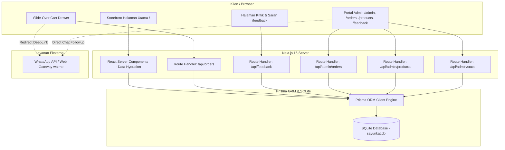
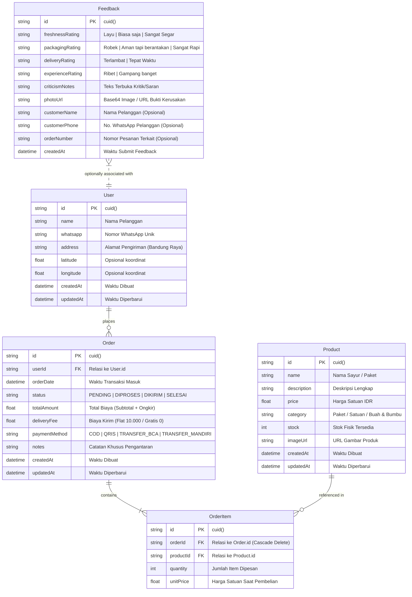
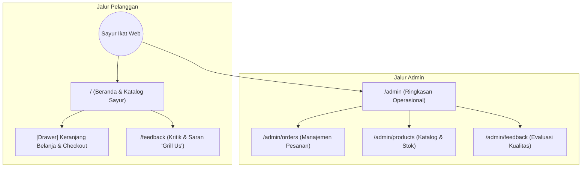
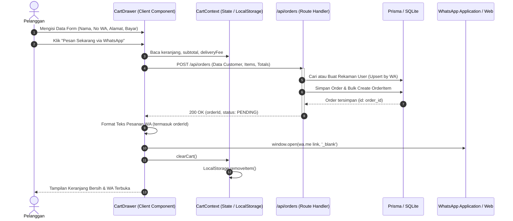
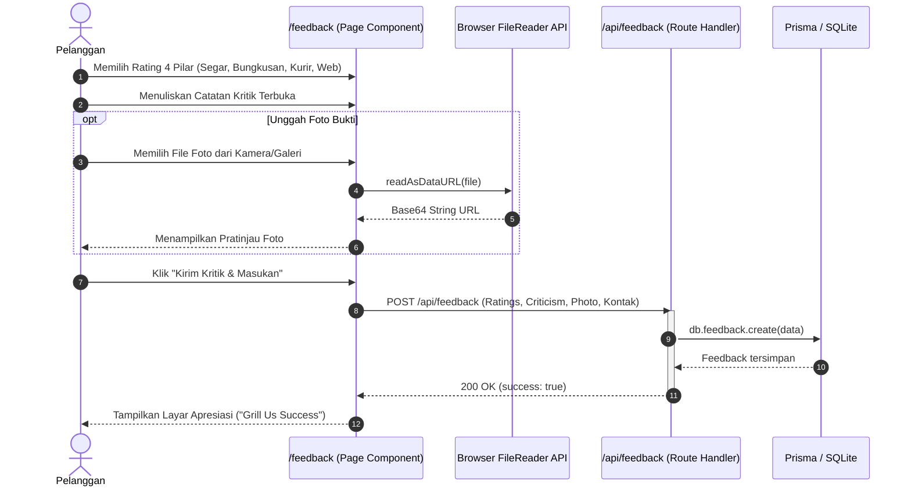
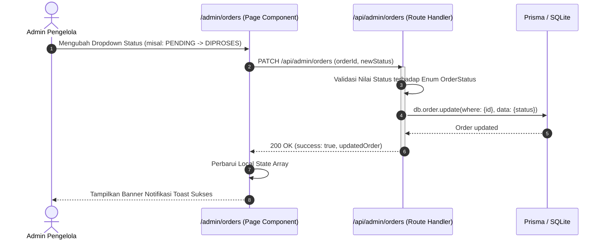
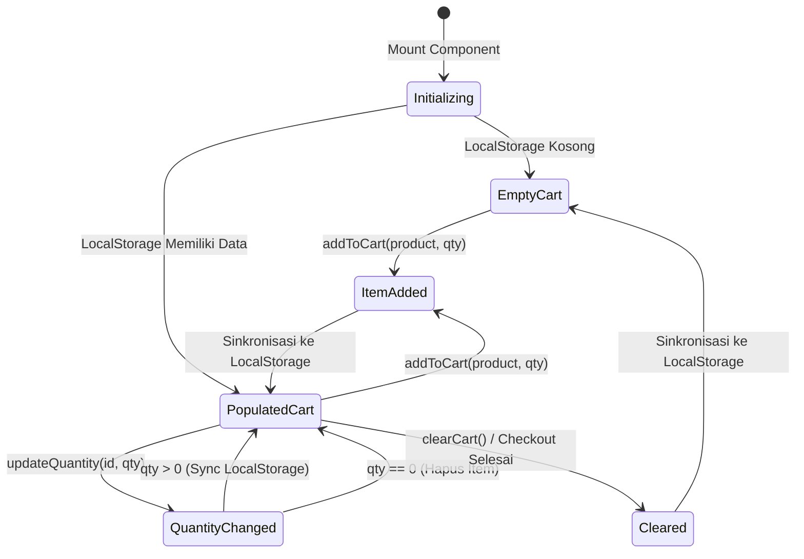

# DESKRIPSI PERANCANGAN PERANGKAT LUNAK (DPPL)
## Aplikasi Web Pemesanan & Operasional Sayur Ikat (Zero-Waste & Organic Grocery)

**Nomor Dokumen:** DPPL-SI-2026  
**Revisi:** 1.0  
**Tanggal:** 6 Oktober 2026  
**Penulis:** Tim Pengembang Sayur Ikat  
**Standar:** Mengadaptasi IEEE Std 1016-2009 (*Standard for Information Technology — Systems Design — Software Design Descriptions*)

---

## DAFTAR ISI

1. [PENDAHULUAN](#1-pendahuluan)
   - 1.1 [Tujuan Dokumen](#11-tujuan-dokumen)
   - 1.2 [Ruang Lingkup Dokumen](#12-ruang-lingkup-dokumen)
   - 1.3 [Definisi, Singkatan, dan Akronim](#13-definisi-singkatan-dan-akronim)
   - 1.4 [Referensi](#14-referensi)
2. [ARSITEKTUR PERANGKAT LUNAK](#2-arsitektur-perangkat-lunak)
   - 2.1 [Gambaran Umum Arsitektur Sistem](#21-gambaran-umum-arsitektur-sistem)
   - 2.2 [Pola Perancangan (*Architectural Pattern*)](#22-pola-perancangan-architectural-pattern)
   - 2.3 [Dekomposisi Lapisan Sistem (*Layered Architecture*)](#23-dekomposisi-lapisan-sistem-layered-architecture)
3. [PERANCANGAN DATA DAN BASIS DATA](#3-perancangan-data-dan-basis-data)
   - 3.1 [Entity Relationship Diagram (ERD)](#31-entity-relationship-diagram-erd)
   - 3.2 [Spesifikasi dan Kamus Data Tabel Basis Data](#32-spesifikasi-dan-kamus-data-tabel-basis-data)
     - 3.2.1 Tabel `users`
     - 3.2.2 Tabel `products`
     - 3.2.3 Tabel `orders`
     - 3.2.4 Tabel `order_items`
     - 3.2.5 Tabel `feedbacks`
   - 3.3 [Integritas Data dan Relasi Entitas](#33-integritas-data-dan-relasi-entitas)
4. [PERANCANGAN ANTARMUKA](#4-perancangan-antarmuka)
   - 4.1 [Peta Situs & Alur Navigasi (*Site Map*)](#41-peta-situs--alur-navigasi-site-map)
   - 4.2 [Perancangan Antarmuka Pengguna (UI Wireframe/Layout)](#42-perancangan-antarmuka-pengguna-ui-wireframelayout)
   - 4.3 [Kontrak Spesifikasi API (*REST API Contract*)](#43-kontrak-spesifikasi-api-rest-api-contract)
   - 4.4 [Perancangan Integrasi Tautan Komunikasi WhatsApp](#44-perancangan-integrasi-tautan-komunikasi-whatsapp)
5. [PERANCANGAN KOMPONEN & DIAGRAM SEKUENSI](#5-perancangan-komponen--diagram-sekuensi)
   - 5.1 [Diagram Sekuensi Alur Pemesanan & WhatsApp Checkout](#51-diagram-sekuensi-alur-pemesanan--whatsapp-checkout)
   - 5.2 [Diagram Sekuensi Pengiriman Evaluasi & Kritik Pelanggan](#52-diagram-sekuensi-pengiriman-evaluasi--kritik-pelanggan)
   - 5.3 [Diagram Sekuensi Pembaruan Status Pesanan oleh Admin](#53-diagram-sekuensi-pembaruan-status-pesanan-oleh-admin)
   - 5.4 [Perancangan State Management Sisi Klien (`CartContext`)](#54-perancangan-state-management-sisi-klien-cartcontext)
6. [MATRIKS KETERTELUSURAN PERANCANGAN](#6-matriks-ketertelusuran-perancangan)

---

## 1. PENDAHULUAN

### 1.1 Tujuan Dokumen
Dokumen Deskripsi Perancangan Perangkat Lunak (DPPL) ini disusun untuk memberikan cetak biru (*blueprint*) teknis arsitektur perangkat lunak, perancangan basis data relasional, kontrak antarmuka pemrograman aplikasi (API), serta perancangan komponen logika sistem pada aplikasi web **Sayur Ikat**. Dokumen ini menjadi pedoman implementasi dan pemeliharaan teknis bagi perekayasa perangkat lunak (*software engineers*).

### 1.2 Ruang Lingkup Dokumen
Dokumen ini merinci aspek internal perancangan aplikasi:
- Arsitektur berbasis framework Next.js 16 (React 19 & TypeScript) dengan model *Server Components* dan *Client Components*.
- Struktur basis data menggunakan SQLite dan Prisma ORM.
- Komunikasi antar-modul melalui *RESTful Route Handlers*.
- Algoritma pembentukan teks dan deep linking integrasi WhatsApp.
- Mekanisme penanganan konkurensi dan integritas referensial data pesanan dan produk.

### 1.3 Definisi, Singkatan, dan Akronim
- **DPPL**: Deskripsi Perancangan Perangkat Lunak.
- **SKPL**: Spesifikasi Kebutuhan Perangkat Lunak.
- **ERD**: *Entity Relationship Diagram*.
- **API**: *Application Programming Interface*.
- **RSC**: *React Server Component* (dijalankan di lingkungan server Node.js).
- **RCC**: *React Client Component* (komponen yang direhidrasi di browser klien).
- **CUID**: *Collision-resistant Unique Identifier* (identitas unik string acak tahan tabrakan).

### 1.4 Referensi
- Dokumen SKPL Sayur Ikat (Nomor Dokumen: `SKPL-SI-2026`).
- Standar IEEE Std 1016-2009 untuk *Software Design Descriptions*.
- Dokumentasi Prisma ORM Schema Reference (`https://www.prisma.io/docs/reference/api-reference/prisma-schema-reference`).

---

## 2. ARSITEKTUR PERANGKAT LUNAK

### 2.1 Gambaran Umum Arsitektur Sistem
Aplikasi Sayur Ikat dirancang dengan arsitektur **Full-Stack Monorepo** memanfaatkan paradigma **App Router Next.js 16**. Server bertindak sebagai perender antarmuka sisi server (*Server-Side Rendering*), penyedia API RESTful, serta jembatan interaksi basis data melalui Prisma Client.



### 2.2 Pola Perancangan (*Architectural Pattern*)
1. **Component-Based Architecture**: Pemecahan UI menjadi komponen modular independen (`Navbar`, `Hero`, `ProductCatalog`, `ProductCard`, `CartDrawer`, `AdminSidebar`, `AdminHeader`).
2. **Context & Provider Pattern**: Pengelolaan *global cart state* menggunakan React Context API (`CartContext`) yang terhubung langsung secara reaktif dengan `window.localStorage`.
3. **Repository / ORM Pattern**: Abstraksi kueri database melalui Prisma Client terpusat di `src/lib/db.ts` yang menggunakan instansiasi tunggal (*singleton instance*) guna mencegah kebocoran koneksi (*connection exhaustion*) saat *hot-reloading*.
4. **Adapter / Gateway Pattern**: Modul `src/lib/whatsapp.ts` mengisolasi format pembuat pesan WhatsApp sehingga perubahan nomor admin atau template format tidak memengaruhi komponen UI.

### 2.3 Dekomposisi Lapisan Sistem (*Layered Architecture*)

| Lapisan | Komponen | Peran dan Tanggung Jawab |
| :--- | :--- | :--- |
| **Presentation Layer (UI)** | `src/app/**/page.tsx`, `src/components/**/*.tsx` | Merender antarmuka pengguna responsif dengan Tailwind CSS, menangani interaksi klik, validasi input formulir di sisi browser. |
| **State Management Layer** | `src/context/CartContext.tsx` | Menyimpan daftar belanjaan, kuantitas, kalkulasi subtotal dan ongkos kirim secara reaktif. |
| **Application / Business Logic Layer** | `src/app/api/**/*.ts`, `src/lib/whatsapp.ts` | Mengimplementasikan validasi aturan bisnis (validasi wajib isi alamat Bandung Raya, formula ambang batas gratis ongkir Rp 50.000, aturan status pesanan, dan formatting teks WhatsApp). |
| **Data Access Layer** | `src/lib/db.ts`, Prisma Client | Menyediakan antarmuka kueri tipe aman (*type-safe queries*) ke tabel-tabel SQLite. |
| **Persistence Layer** | `prisma/dev.db` (SQLite) | Menyimpan data entitas persisten pengguna, produk, transaksi, dan kritik pelanggan. |

---

## 3. PERANCANGAN DATA DAN BASIS DATA

### 3.1 Entity Relationship Diagram (ERD)



---

### 3.2 Spesifikasi dan Kamus Data Tabel Basis Data

#### 3.2.1 Tabel `users`
Menyimpan profil identitas pelanggan yang pernah melakukan pemesanan.
- **Nama Tabel Fisik**: `users`
- **Primary Key**: `id`

| Nama Kolom | Tipe Data | Nullable | Nilai Default | Deskripsi & Aturan |
| :--- | :--- | :--- | :--- | :--- |
| `id` | VARCHAR(30) | No | `cuid()` | Kunci primer identitas pengguna tahan tabrakan. |
| `name` | VARCHAR(100) | No | - | Nama lengkap penerima pesanan. |
| `whatsapp` | VARCHAR(20) | No | - | Nomor kontak WhatsApp aktif pemesan (kunci pencarian riwayat). |
| `address` | TEXT | No | - | Alamat jalan, nomor rumah, perumahan di area Bandung Raya. |
| `latitude` | FLOAT | Yes | NULL | Koordinat garis lintang (disiapkan untuk modul rute kurir). |
| `longitude`| FLOAT | Yes | NULL | Koordinat garis bujur (disiapkan untuk modul rute kurir). |
| `createdAt`| DATETIME | No | `now()` | Waktu pertama kali tercatat di sistem. |
| `updatedAt`| DATETIME | No | `now()` | Waktu terakhir pembaruan profil pengguna. |

---

#### 3.2.2 Tabel `products`
Menyimpan inventaris katalog produk sayuran organik, paket masak, dan bumbu dapur.
- **Nama Tabel Fisik**: `products`
- **Primary Key**: `id`

| Nama Kolom | Tipe Data | Nullable | Nilai Default | Deskripsi & Aturan |
| :--- | :--- | :--- | :--- | :--- |
| `id` | VARCHAR(30) | No | `cuid()` | Identitas unik produk. |
| `name` | VARCHAR(150) | No | - | Nama produk (misal: "Paket Sayur Asem", "Kangkung Ikat"). |
| `description`| TEXT | No | - | Uraian manfaat, komposisi sayur, atau instruksi masak. |
| `price` | REAL/FLOAT | No | - | Harga jual produk dalam mata uang Rupiah. |
| `category` | VARCHAR(50) | No | - | Kategori produk: 'Paket', 'Satuan', 'Buah & Bumbu'. |
| `stock` | INTEGER | No | `0` | Jumlah fisik yang tersedia. Nilai `0` menandakan habis/tidak aktif. |
| `imageUrl` | TEXT | No | - | Tautan URL atau berkas gambar produk beresolusi tinggi. |
| `createdAt`| DATETIME | No | `now()` | Waktu penambahan produk ke katalog. |
| `updatedAt`| DATETIME | No | `now()` | Waktu pembaruan harga atau stok. |

---

#### 3.2.3 Tabel `orders`
Menyimpan data induk pesanan transaksi pelanggan.
- **Nama Tabel Fisik**: `orders`
- **Primary Key**: `id`
- **Foreign Key**: `userId` mereferensikan `users(id)`

| Nama Kolom | Tipe Data | Nullable | Nilai Default | Deskripsi & Aturan |
| :--- | :--- | :--- | :--- | :--- |
| `id` | VARCHAR(30) | No | `cuid()` | Nomor unik transaksi pesanan. |
| `userId` | VARCHAR(30) | No | - | Referensi ID pelanggan pemesan. |
| `orderDate` | DATETIME | No | `now()` | Tanggal dan jam pembuatan pesanan. |
| `status` | VARCHAR(20) | No | `'PENDING'` | Status: `'PENDING'`, `'DIPROSES'`, `'DIKIRIM'`, `'SELESAI'`. |
| `totalAmount`| REAL/FLOAT | No | - | Total tagihan (Subtotal produk + Ongkir). |
| `deliveryFee`| REAL/FLOAT | No | `10000` | Biaya kirim (0 jika gratis ongkir $\ge$ Rp 50.000). |
| `paymentMethod`| VARCHAR(30)| No | `'COD'` | Opsi: `'COD'`, `'QRIS'`, `'TRANSFER_BCA'`, `'TRANSFER_MANDIRI'`. |
| `notes` | TEXT | Yes | NULL | Instruksi pengantaran (misal: "Taruh di pagar"). |
| `createdAt`| DATETIME | No | `now()` | Waktu rekaman dibuat di basis data. |
| `updatedAt`| DATETIME | No | `now()` | Waktu perubahan status pesanan. |

---

#### 3.2.4 Tabel `order_items`
Menyimpan rincian item produk yang dibeli pada setiap pesanan (*snapshot line-item*).
- **Nama Tabel Fisik**: `order_items`
- **Primary Key**: `id`
- **Foreign Keys**: `orderId` -> `orders(id)` (ON DELETE CASCADE), `productId` -> `products(id)`

| Nama Kolom | Tipe Data | Nullable | Nilai Default | Deskripsi & Aturan |
| :--- | :--- | :--- | :--- | :--- |
| `id` | VARCHAR(30) | No | `cuid()` | Identitas unik item pesanan. |
| `orderId` | VARCHAR(30) | No | - | Referensi ID pesanan induk. |
| `productId`| VARCHAR(30) | No | - | Referensi ID produk yang dibeli. |
| `quantity` | INTEGER | No | `1` | Jumlah kuantitas produk yang dipesan. |
| `unitPrice`| REAL/FLOAT | No | - | *Snapshot* harga satuan produk pada saat transaksi terjadi. |

---

#### 3.2.5 Tabel `feedbacks`
Menyimpan data evaluasi, rating mutu, dan komplain pelanggan.
- **Nama Tabel Fisik**: `feedbacks`
- **Primary Key**: `id`

| Nama Kolom | Tipe Data | Nullable | Nilai Default | Deskripsi & Aturan |
| :--- | :--- | :--- | :--- | :--- |
| `id` | VARCHAR(30) | No | `cuid()` | Kunci primer identitas feedback. |
| `freshnessRating` | VARCHAR(30) | No | - | Pilihan: `'Layu'`, `'Biasa saja'`, `'Sangat Segar'`. |
| `packagingRating` | VARCHAR(30) | No | - | Pilihan: `'Robek'`, `'Aman tapi berantakan'`, `'Sangat Rapi'`. |
| `deliveryRating` | VARCHAR(30) | No | - | Pilihan: `'Terlambat'`, `'Tepat Waktu'`. |
| `experienceRating`| VARCHAR(30) | No | - | Pilihan: `'Ribet'`, `'Gampang banget'`. |
| `criticismNotes` | TEXT | No | - | Catatan kritik pedas / saran terbuka pelanggan. |
| `photoUrl` | TEXT | Yes | NULL | String data gambar (Base64 Data URI) atau link foto bukti. |
| `customerName` | VARCHAR(100)| Yes | NULL | Nama pemohon kompensasi (opsional). |
| `customerPhone` | VARCHAR(20) | Yes | NULL | Nomor WhatsApp pemohon kompensasi (opsional). |
| `orderNumber` | VARCHAR(50) | Yes | NULL | Nomor referensi pesanan terkait (opsional). |
| `createdAt` | DATETIME | No | `now()` | Waktu perekaman saran ke sistem. |

---

### 3.3 Integritas Data dan Relasi Entitas
1. **Pencegahan Data Yatim (*Cascade Delete*)**: Jika sebuah entitas `Order` dihapus, seluruh entitas anak di tabel `order_items` yang terhubung secara otomatis ikut terhapus (*ON DELETE CASCADE*).
2. **Proteksi Integritas Katalog (*Restrict Deletion*)**: Produk yang sudah pernah dipesan (`order_items.productId` sudah ada) tidak boleh dihapus secara permanen via kueri `DELETE`. Sistem menerapkan aturan bisnis *soft deactivation* di API (`src/app/api/admin/products/route.ts` baris 114-129) dengan menyetel `stock = 0`.
3. **Penyelarasan Pengguna Unik (*Upsert Pattern*)**: Saat pelanggan melakukan *checkout*, sistem mencari nomor WhatsApp pemesan di tabel `users`. Jika ditemukan, nama dan alamat terakhir diperbarui; jika belum ada, rekaman `User` baru otomatis dibuat.

---

## 4. PERANCANGAN ANTARMUKA

### 4.1 Peta Situs & Alur Navigasi (*Site Map*)



### 4.2 Perancangan Antarmuka Pengguna (UI Wireframe/Layout)

#### 1. Halaman Beranda & Katalog (`/`)
- **Top Announcement Bar**: Pengumuman batasan operasional ("Pengiriman Area Bandung Raya • Pesan Sebelum Jam 12.00 WIB").
- **Header**: Logo Sayur Ikat, tautan "Kritik & Saran", dan tombol "Keranjang" dengan penanda jumlah kuantitas (*item badge*).
- **Hero Section**: Ilustrasi kemasan besek bambu dan daun pisang dengan tombol ajakan bertindak (*Call-to-Action*: "Pilih Paket Sayur" & "Lihat Sayur Satuan").
- **Product Filter Tabs**: Tab navigasi kategori ("Semua Produk", "Paket Sayur", "Sayur Satuan", "Buah & Bumbu").
- **Product Card**: Gambar sayuran segar, badge label ("100% Bebas Plastik" / "Panen Subuh"), indikator asal petani lokal ("Kelompok Tani Organik Bandung"), harga satuan IDR, dan tombol interaktif "+ Keranjang".

#### 2. Slide-Over Drawer Keranjang Belanja
- Terbuka dari sisi kanan layar saat tombol keranjang diklik.
- Daftar item belanja dilengkapi tombol stepper kuantitas (`-`, `+`) dan hapus item.
- Kalkulator ongkir transparan: Menampilkan "GRATIS" jika $\ge$ Rp 50.000 atau "Rp 10.000" jika di bawahnya.
- Formulir Data Pemesan: Input Nama, Nomor WhatsApp, Alamat Lengkap Bandung Raya, dan Catatan Khusus.
- Pilihan Metode Pembayaran Radio Buttons: COD, QRIS, Transfer BCA, Transfer Mandiri.
- Tombol Utama: "Lanjut Pesan via WhatsApp" (mengeksekusi simpan order ke server lalu membuka URL WhatsApp).

#### 3. Halaman Kritik & Saran (`/feedback`)
- Mengusung tema transparan "Grill Us: Suara Pelanggan Awal".
- Pemilihan rating berbentuk *toggle button* untuk 4 dimensi kualitas operasional.
- Kotak teks terbuka untuk kritik dan saran detail.
- Komponen *file picker* yang langsung memuat pratinjau (*image preview*) bukti foto kerusakan kemasan.
- Input data kompensasi (Nama & WhatsApp) agar tim dapat memberikan voucher sayur gratis.

---

### 4.3 Kontrak Spesifikasi API (*REST API Contract*)

#### 1. `POST /api/orders`
Menyimpan pesanan baru ke sistem database.
- **Request Headers**: `Content-Type: application/json`
- **Request Body**:
```json
{
  "customer": {
    "name": "Budi Santoso",
    "whatsapp": "081234567890",
    "address": "Jl. Setiabudhi No. 45, Coblong, Kota Bandung",
    "notes": "Tolong jangan dibunyikan bel, gantung di pagar."
  },
  "items": [
    {
      "productId": "cly12345678",
      "quantity": 2,
      "unitPrice": 18000
    }
  ],
  "subtotal": 36000,
  "deliveryFee": 10000,
  "totalAmount": 46000,
  "paymentMethod": "COD"
}
```
- **Response Success (200 OK)**:
```json
{
  "success": true,
  "orderId": "cly890abcdef123",
  "order": { "id": "cly890abcdef123", "status": "PENDING", ... },
  "message": "Pesanan #DEF123 berhasil disimpan ke sistem"
}
```
- **Response Error (400 Bad Request)**:
```json
{
  "success": false,
  "error": "Data nama, nomor WhatsApp, dan alamat pengiriman wajib diisi"
}
```

---

#### 2. `POST /api/feedback`
Menyimpan evaluasi dan kritik pelanggan.
- **Request Body**:
```json
{
  "freshnessRating": "Sangat Segar",
  "packagingRating": "Sangat Rapi",
  "deliveryRating": "Tepat Waktu",
  "experienceRating": "Gampang banget",
  "criticismNotes": "Sayurnya sangat segar, packaging daun pisangnya rapi sekali!",
  "photoUrl": "data:image/jpeg;base64,/9j/4AAQSkZJRg...",
  "customerName": "Siti Rahma",
  "customerPhone": "081298765432",
  "orderNumber": "Pesanan Tgl 5 Okt"
}
```
- **Response Success (200 OK)**:
```json
{
  "success": true,
  "feedback": { "id": "fbk123456", ... },
  "message": "Kritik & saran kamu berhasil kami terima. Terima kasih sudah membantu Sayur Ikat!"
}
```

---

#### 3. `GET /api/admin/stats`
Mengambil data ringkasan KPI untuk halaman overview admin.
- **Response (200 OK)**:
```json
{
  "success": true,
  "stats": {
    "ordersToday": 8,
    "revenueToday": 345000,
    "totalProducts": 14,
    "lowStockProducts": 2,
    "totalOrdersAllTime": 64,
    "revenueAllTime": 2840000
  },
  "recentOrders": [...]
}
```

---

#### 4. `PATCH /api/admin/orders`
Memperbarui status operasional pesanan.
- **Request Body**:
```json
{
  "orderId": "cly890abcdef123",
  "status": "DIPROSES"
}
```
- **Response (200 OK)**:
```json
{
  "success": true,
  "order": { "id": "cly890abcdef123", "status": "DIPROSES", ... },
  "message": "Status pesanan #DEF123 berhasil diubah menjadi DIPROSES"
}
```

---

#### 5. `POST /api/admin/products` & `PUT /api/admin/products`
Menambah atau memperbarui item katalog produk.
- **Request Body**:
```json
{
  "id": "prod123", // Hanya disertakan pada PUT
  "name": "Paket Sayur Capcay Organik",
  "description": "Kombinasi brokoli, wortel, kembang kol, dan sawi putih.",
  "price": 22000,
  "category": "Paket",
  "stock": 25,
  "imageUrl": "https://images.unsplash.com/..."
}
```

---

### 4.4 Perancangan Integrasi Tautan Komunikasi WhatsApp

Algoritma pembentukan link pesan WhatsApp dirancang pada modul `src/lib/whatsapp.ts`. Alur pembentukan pesan:

1. **Format Teks Terstruktur**:
   ```text
   Halo Admin Sayur Ikat! 🍃 Saya telah membuat pesanan #ABC123:
   
   🛒 DETAIL PESANAN:
   • 1x Paket Sayur Asem Komplit (Rp 18.000)
   • 2x Kangkung Ikat Daun Pisang (Rp 16.000)
   
   💳 METODE PEMBAYARAN:
   💵 Bayar di Tempat (COD)
   
   💰 RINCIAN BIAYA:
   • Subtotal Sayur: Rp 34.000
   • Biaya Kirim: Rp 10.000
   • Total Bayar: Rp 44.000
   
   📍 DATA PENGIRIMAN:
   Nama: Budi Santoso
   No. WA: 081234567890
   Alamat Lengkap: Jl. Gading Golf Timur No. 8, Gading Serpong
   Catatan Khusus: Titip di pos sekuriti
   
   Mohon diproses pesanannya ya. Terima kasih!
   ```
2. **Encoding URI**: Teks diubah menjadi format persentase URL (*RFC 3986*) melalui fungsi `encodeURIComponent(message)`.
3. **Deep Link Generation**: Menggabungkan URI dengan nomor WhatsApp Admin:  
   `https://wa.me/6281111090906?text={encodedMessage}`

---

## 5. PERANCANGAN KOMPONEN & DIAGRAM SEKUENSI

### 5.1 Diagram Sekuensi Alur Pemesanan & WhatsApp Checkout



---

### 5.2 Diagram Sekuensi Pengiriman Evaluasi & Kritik Pelanggan



---

### 5.3 Diagram Sekuensi Pembaruan Status Pesanan oleh Admin



---

### 5.4 Perancangan State Management Sisi Klien (`CartContext`)

Status keranjang dikelola menggunakan mesin keadaan (*state machine*) sederhana di dalam `CartProvider`:



---

## 6. MATRIKS KETERTELUSURAN PERANCANGAN

Matriks berikut memastikan setiap kebutuhan fungsional yang terdefinisi dalam dokumen SKPL telah diakomodasi oleh komponen perancangan dalam dokumen DPPL:

| ID Kebutuhan SKPL | Elemen Desain Tabel / Basis Data | Endpoint API Terkait | Komponen UI / Logika Perancangan |
| :--- | :--- | :--- | :--- |
| **SKPL-F-01** | `products` | Server-Side Fetch via Prisma | `ProductCatalog.tsx`, `ProductCard.tsx` |
| **SKPL-F-02** | - (Filter Client-Side State) | - | `ProductCatalog.tsx` (State `selectedCategory`) |
| **SKPL-F-03** | - (State `cart[]`) | - | `CartContext.tsx`, `CartDrawer.tsx` |
| **SKPL-F-04** | Web Storage Browser | - | `CartContext.tsx` (`useEffect` LocalStorage sync) |
| **SKPL-F-05** | Formula Bisnis Ongkir | - | `CartContext.tsx` (`subtotal >= 50000 ? 0 : 10000`) |
| **SKPL-F-06** | `users`, `orders` | - | `CartDrawer.tsx` (State `formData`) |
| **SKPL-F-07** | `orders`, `order_items`, `users` | `POST /api/orders` | `src/app/api/orders/route.ts` |
| **SKPL-F-08** | - | - | `src/lib/whatsapp.ts` (`generateWhatsAppLink`) |
| **SKPL-F-09** | `feedbacks` | `POST /api/feedback` | `src/app/feedback/page.tsx` |
| **SKPL-F-10** | `feedbacks.photoUrl` | `POST /api/feedback` | `FileReader.readAsDataURL()` |
| **SKPL-F-11** | `feedbacks.customerPhone` | `POST /api/feedback` | `src/app/feedback/page.tsx` |
| **SKPL-F-12** | - | - | `src/app/feedback/page.tsx` (`sendToWhatsApp`) |
| **SKPL-F-13** | `orders`, `products` | `GET /api/admin/stats` | `src/app/admin/page.tsx` |
| **SKPL-F-14** | `orders`, `users`, `order_items` | `GET /api/admin/orders` | `src/app/admin/orders/page.tsx` |
| **SKPL-F-15** | - (Filter Client-Side State) | - | `src/app/admin/orders/page.tsx` |
| **SKPL-F-16** | `orders.status` | `PATCH /api/admin/orders` | `src/app/admin/orders/page.tsx` |
| **SKPL-F-17** | `orders`, `order_items` | - | `src/app/admin/orders/page.tsx` (Detail Modal) |
| **SKPL-F-18** | `products` | `GET /api/admin/products` | `src/app/admin/products/page.tsx` |
| **SKPL-F-19** | `products` | `POST` / `PUT /api/admin/products` | `src/app/admin/products/page.tsx` (Product Modal) |
| **SKPL-F-20** | `products`, `order_items` | `DELETE /api/admin/products` | `src/app/api/admin/products/route.ts` (Soft Check) |
| **SKPL-F-21** | `feedbacks` | `GET /api/feedback` | `src/app/admin/feedback/page.tsx` |
| **SKPL-F-22** | - | - | `src/app/admin/feedback/page.tsx` (Deep Link WA) |
