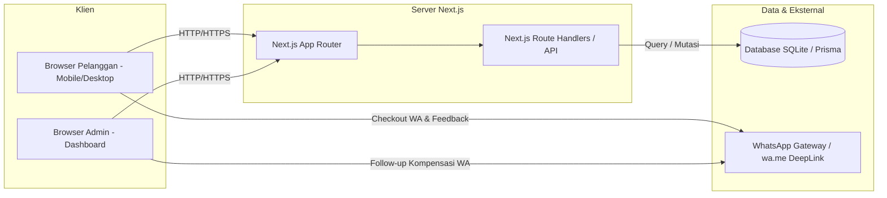

# SPESIFIKASI KEBUTUHAN PERANGKAT LUNAK (SKPL)
## Aplikasi Web Pemesanan & Operasional Sayur Ikat (Zero-Waste & Organic Grocery)

**Nomor Dokumen:** SKPL-SI-2026  
**Revisi:** 1.0  
**Tanggal:** 6 Oktober 2026  
**Penulis:** Tim Pengembang Sayur Ikat  
**Standar:** Mengadaptasi IEEE Std 830-1998 (*Recommended Practice for Software Requirements Specifications*)

---

## DAFTAR ISI

1. [PENDAHULUAN](#1-pendahuluan)
   - 1.1 [Tujuan Dokumen](#11-tujuan-dokumen)
   - 1.2 [Lingkup Masalah](#12-lingkup-masalah)
   - 1.3 [Definisi, Singkatan, dan Akronim](#13-definisi-singkatan-dan-akronim)
   - 1.4 [Referensi](#14-referensi)
   - 1.5 [Gambaran Umum Dokumen](#15-gambaran-umum-dokumen)
2. [DESKRIPSI UMUM SISTEM](#2-deskripsi-umum-sistem)
   - 2.1 [Perspektif Produk](#21-perspektif-produk)
   - 2.2 [Fungsi Utama Produk](#22-fungsi-utama-produk)
   - 2.3 [Karakteristik Pengguna](#23-karakteristik-pengguna)
   - 2.4 [Batasan Sistem](#24-batasan-sistem)
   - 2.5 [Asumsi dan Ketergantungan](#25-asumsi-dan-ketergantungan)
3. [KEBUTUHAN SPESIFIK](#3-kebutuhan-spesifik)
   - 3.1 [Kebutuhan Antarmuka Eksternal](#31-kebutuhan-antarmuka-eksternal)
     - 3.1.1 Antarmuka Pengguna (*User Interface*)
     - 3.1.2 Antarmuka Perangkat Keras (*Hardware Interface*)
     - 3.1.3 Antarmuka Perangkat Lunak (*Software Interface*)
     - 3.1.4 Antarmuka Komunikasi (*Communication Interface*)
   - 3.2 [Kebutuhan Fungsional](#32-kebutuhan-fungsional)
     - 3.2.1 Diagram Use Case
     - 3.2.2 Rincian Kebutuhan Fungsional (SKPL-F-xxx)
   - 3.3 [Kebutuhan Non-Fungsional](#33-kebutuhan-non-fungsional)
     - 3.3.1 Kinerja (*Performance*)
     - 3.3.2 Ketersediaan (*Availability*)
     - 3.3.3 Keamanan (*Security*)
     - 3.3.4 Kegunaan & Aksesibilitas (*Usability*)
     - 3.3.5 Portabilitas (*Portability*)
4. [LAMPIRAN DAN MATRIKS KEBUTUHAN](#4-lampiran-dan-matriks-kebutuhan)

---

## 1. PENDAHULUAN

### 1.1 Tujuan Dokumen
Dokumen Spesifikasi Kebutuhan Perangkat Lunak (SKPL) ini disusun untuk mendefinisikan seluruh kebutuhan fungsional, non-fungsional, dan batasan operasional dari aplikasi web **Sayur Ikat**. Dokumen ini menjadi acuan utama bagi tim pengembang (*software engineers*), analis sistem, penguji kualitas (*quality assurance*), serta pengelola bisnis (*stakeholders*) dalam memvalidasi fungsionalitas dan penerimaan sistem (*user acceptance*).

### 1.2 Lingkup Masalah
Sayur Ikat adalah platform *groceries* hiper-lokal yang menyediakan sayur segar organik, paket memasak harian, serta bumbu dapur dengan konsep **bebas plastik (zero plastic packaging)** menggunakan besek bambu dan pembungkus daun pisang. 

Lingkup sistem mencakup:
1. **Sisi Pelanggan (Storefront)**:
   - Eksplorasi katalog produk sayur (paket masakan, sayuran satuan, rempah & buah).
   - Keranjang belanja interaktif (*slide-over drawer*) dengan perhitungan otomatis subtotal dan biaya pengiriman flat/bebas ongkir.
   - *Checkout* pesanan dengan persistensi data ke database dan pembuatan pesan terstruktur otomatis ke WhatsApp Admin (*WhatsApp-assisted checkout*).
   - Formulir evaluasi kualitas (*Quality Control / Grill Us Feedback*) dengan rating multidimensi, catatan terbuka, serta unggah foto bukti kerusakan sayur.
2. **Sisi Pengelola (Admin Dashboard)**:
   - Pemantauan metrik ringkasan operasional harian (total pesanan, total omset/pendapatan, produk berstok kritis).
   - Manajemen siklus hidup status pesanan (*PENDING*, *DIPROSES*, *DIKIRIM*, *SELESAI*).
   - Manajemen katalog produk (tambah, ubah harga/stok/kategori/foto, penonaktifan ketersediaan produk aman relasi data).
   - Pemantauan dan tindak lanjut (*follow-up*) kritik pelanggan langsung ke WhatsApp pelanggan untuk pemberian kompensasi.

Sistem tidak mencakup:
- Integrasi otomatis payment gateway pihak ketiga (menggunakan konfirmasi pembayaran manual via WA / transfer bank / COD).
- Pelacakan GPS kurir secara *real-time* berbasis peta (lokasi pengiriman berbasis alamat teks dan wilayah layanan Tangerang & Gading Serpong).

### 1.3 Definisi, Singkatan, dan Akronim
- **SKPL**: Spesifikasi Kebutuhan Perangkat Lunak (padanan bahasa Indonesia untuk *Software Requirements Specification* - SRS).
- **DPPL**: Deskripsi Perancangan Perangkat Lunak (padanan bahasa Indonesia untuk *Software Design Description* - SDD).
- **Zero-Waste**: Konsep distribusi ramah lingkungan tanpa plastik sekali pakai, menggunakan daun pisang dan besek.
- **SSR / RSC**: *Server-Side Rendering* / *React Server Components* pada arsitektur Next.js App Router.
- **ORM**: *Object-Relational Mapping* (Prisma ORM).
- **COD**: *Cash on Delivery* (Bayar di Tempat).
- **QRIS**: *Quick Response Code Indonesian Standard*.

### 1.4 Referensi
1. IEEE Std 830-1998, *IEEE Recommended Practice for Software Requirements Specifications*.
2. Dokumentasi Resmi Next.js App Router (`https://nextjs.org/docs`).
3. Dokumentasi Resmi Prisma ORM (`https://www.prisma.io/docs`).
4. Panduan Pengguna (*User Guide*) Aplikasi Sayur Ikat.

### 1.5 Gambaran Umum Dokumen
Dokumen ini terdiri dari 4 bagian utama: Bab 1 memuat gambaran umum proyek dan definisi istilah; Bab 2 memuat perspektif, karakteristik pengguna, dan batasan umum; Bab 3 memaparkan kebutuhan spesifik (antarmuka, kebutuhan fungsional terinci, dan kebutuhan non-fungsional); Bab 4 merangkum matriks kebutuhan fungsional perangkat lunak.

---

## 2. DESKRIPSI UMUM SISTEM

### 2.1 Perspektif Produk
Aplikasi Sayur Ikat adalah aplikasi web mandiri (*standalone web-based application*) dengan arsitektur modern berbasis monorepo fullstack (Next.js App Router). Sistem ini menggabungkan antara antarmuka publik berbasis web yang responsif dengan ekosistem obrolan WhatsApp yang merupakan kanal komunikasi paling lazim bagi konsumen rumah tangga di Indonesia.



### 2.2 Fungsi Utama Produk
Secara ringkas, sistem menyediakan fungsi-fungsi berikut:
1. Menampilkan katalog sayur segar dengan informasi transparan (nama produk, harga, stok, badge kualitas, asal petani lokal, porsi saji).
2. Memfasilitasi pemilihan produk ke keranjang belanja lokal yang tidak hilang saat *page refresh*.
3. Menyimpan pesanan baru ke basis data server secara permanen dan menghasilkan link transaksi WhatsApp siap kirim.
4. Memberikan sarana umpan balik pelanggan (*customer voice*) yang mencakup 4 pilar kualitas dan upload bukti foto.
5. Menyediakan panel admin terpadu untuk monitoring omset harian, pemrosesan pesanan, pengelolaan stok sayur, dan penanganan feedback.

### 2.3 Karakteristik Pengguna
Pengguna sistem Sayur Ikat terbagi ke dalam 2 aktor utama:

| Aktor | Deskripsi Peran | Hak Akses | Tingkat Keterampilan Komputer |
| :--- | :--- | :--- | :--- |
| **Pelanggan (Customer)** | Konsumen rumah tangga di area Gading Serpong & Tangerang yang ingin membeli sayuran organik. | Mengakses katalog (`/`), mengelola keranjang, mengirim pesanan, mengirim form feedback (`/feedback`). | Pemula / Pengguna ponsel cerdas umum. |
| **Pengelola Toko (Admin)** | Pengelola dapur, kurir, dan layanan pelanggan Sayur Ikat. | Mengakses seluruh fitur manajemen di portal admin (`/admin`, `/admin/orders`, `/admin/products`, `/admin/feedback`). | Menengah / Terbiasa menggunakan web browser. |

### 2.4 Batasan Sistem
1. **Area Operasional**: Pengiriman hanya mencakup area Tangerang dan Gading Serpong, Banten.
2. **Jadwal Pemesanan**: Pesanan sebelum pukul 12.00 WIB dikirim pada hari berjalan; setelah pukul 12.00 WIB berpotensi dijadwalkan pada hari pengantaran berikutnya.
3. **Penyimpanan Gambar**: Bukti foto feedback disimpan secara terenkode *Base64 string* atau URL gambar publik, dengan batasan ukuran file maksimal 5 MB.
4. **Basis Data**: Menggunakan SQLite yang terhubung melalui Prisma ORM untuk menjamin portabilitas dan kecepatan *development/deployment*.
5. **Autentikasi Admin**: Akses dashboard internal disiapkan melalui portal `/admin` langsung dengan pengamanan rute terpisah.

### 2.5 Asumsi dan Ketergantungan
- Pengguna diasumsikan memiliki perangkat yang terpasang aplikasi WhatsApp atau WhatsApp Web dengan nomor telepon aktif.
- Koneksi internet stabil dibutuhkan untuk merender katalog produk dan mengirim data form ke API server.

---

## 3. KEBUTUHAN SPESIFIK

### 3.1 Kebutuhan Antarmuka Eksternal

#### 3.1.1 Antarmuka Pengguna (*User Interface*)
1. Desain menggunakan tema visual organik, *earthy-tones* (`#FAF7F2` latar belakang, `#2D5A27` hijau daun utama, `#D96B43` terakota aksen).
2. Tampilan *responsive web design* yang optimal baik di layar *smartphone* (mobile-first) maupun layar desktop/laptop.
3. Keranjang belanja menggunakan model *slide-over drawer* kanan yang intuitif tanpa memuat ulang (*reloading*) seluruh halaman.
4. Notifikasi umpan balik instan (*Toast notifications*) atas setiap operasi simpan/edit/ubah status.

#### 3.1.2 Antarmuka Perangkat Keras (*Hardware Interface*)
- Perangkat klien: PC, laptop, tablet, atau smartphone dengan spesifikasi minimal RAM 2 GB dan resolusi layar minimal 360x640 pixel.
- Perangkat server: Mesin dengan memori minimal 512 MB RAM dan ruang disk minimal 1 GB.

#### 3.1.3 Antarmuka Perangkat Lunak (*Software Interface*)
- **Sistem Operasi Klien**: Android, iOS, Windows, macOS, Linux dengan peramban web modern (Google Chrome, Safari, Mozilla Firefox, Microsoft Edge).
- **Runtime Server**: Node.js versi 18.x ke atas.
- **Framework Web**: Next.js 16 (App Router), React 19, TypeScript.
- **ORM & Database**: Prisma ORM v6 dengan SQLite database.

#### 3.1.4 Antarmuka Komunikasi (*Communication Interface*)
- Protokol komunikasi: HTTP/HTTPS untuk transmisi data REST API JSON.
- Protokol integrasi pesan: WhatsApp URI Scheme (`https://wa.me/{nomor}?text={pesan_terenkode_uri}`).

---

### 3.2 Kebutuhan Fungsional

#### 3.2.1 Diagram Use Case

```mermaid
usecaseDiagram
    actor "Pelanggan" as Cust
    actor "Admin Toko" as Adm

    package "Aplikasi Web Sayur Ikat" {
        usecase "UC-01: Melihat Katalog & Detail Produk" as UC1
        usecase "UC-02: Mengelola Keranjang Belanja" as UC2
        usecase "UC-03: Melakukan Checkout Pesanan" as UC3
        usecase "UC-04: Mengirim Kritik & Saran (Feedback)" as UC4
        usecase "UC-05: Memantau Statistik Ringkasan Operasional" as UC5
        usecase "UC-06: Mengelola Status Pesanan" as UC6
        usecase "UC-07: Mengelola Produk & Stok Sayur" as UC7
        usecase "UC-08: Meninjau & Menindaklanjuti Feedback" as UC8
    }

    Cust --> UC1
    Cust --> UC2
    Cust --> UC3
    Cust --> UC4

    Adm --> UC5
    Adm --> UC6
    Adm --> UC7
    Adm --> UC8
```

---

#### 3.2.2 Rincian Kebutuhan Fungsional

##### KELOMPOK 1: MODUL PELANGGAN (STOREFRONT)

| Kode Kebutuhan | Nama Kebutuhan | Deskripsi Fungsionalitas | Prioritas |
| :--- | :--- | :--- | :--- |
| **SKPL-F-01** | Menampilkan Katalog Produk | Sistem harus menampilkan daftar produk sayur aktif beserta foto, nama, deskripsi singkat, kategori (Paket / Satuan / Buah & Bumbu), harga (IDR), stok tersedia, info porsi saji, badge kualitas (*100% Bebas Plastik*, *Panen Subuh*), dan identitas kelompok tani asal. | **Tinggi (Must Have)** |
| **SKPL-F-02** | Filter Kategori Produk | Sistem harus memungkinkan pelanggan menyaring tampilan katalog berdasarkan kategori (Semua Produk, Paket Sayur, Sayur Satuan, Buah & Bumbu). | **Tinggi (Must Have)** |
| **SKPL-F-03** | Manajemen Keranjang Belanja | Sistem harus memungkinkan pelanggan menambahkan produk ke keranjang, menambah/mengurangi kuantitas, menghapus item, serta mengosongkan keranjang. | **Tinggi (Must Have)** |
| **SKPL-F-04** | Persistensi Keranjang Lokal | Sistem harus menyimpan isi keranjang ke dalam penyimpanan lokal peramban (*LocalStorage*) sehingga data tidak hilang saat tab ditutup atau dimuat ulang. | **Sedang (Should Have)** |
| **SKPL-F-05** | Perhitungan Biaya Otomatis | Sistem harus menghitung subtotal belanja secara otomatis dan menetapkan ongkos kirim: Gratis Ongkir jika subtotal $\ge$ Rp 50.000; atau dikenakan biaya flat Rp 10.000 jika subtotal $<$ Rp 50.000. | **Tinggi (Must Have)** |
| **SKPL-F-06** | Formulir Pengiriman & Pembayaran | Sistem harus menyediakan formulir *checkout* di dalam drawer yang memvalidasi input nama pelanggan, nomor WhatsApp valid, alamat lengkap di wilayah Tangerang/Serpong, catatan khusus, serta pilihan metode pembayaran (COD, QRIS, Transfer BCA, Transfer Mandiri). | **Tinggi (Must Have)** |
| **SKPL-F-07** | Pencatatan Pesanan ke Server | Sistem harus menyimpan pesanan yang divalidasi ke tabel `orders` dan `order_items` di database dengan status awal `PENDING` melalui endpoint `POST /api/orders`. | **Tinggi (Must Have)** |
| **SKPL-F-08** | Integrasi Deep Link WhatsApp | Sistem harus mengonversi rincian pesanan yang tersimpan menjadi teks format rapi berstruktur (*order header*, ID pesanan, daftar item, total biaya, identitas & alamat) dan membuka tautan *wa.me* ke nomor WhatsApp Admin resmi Sayur Ikat. | **Tinggi (Must Have)** |
| **SKPL-F-09** | Formulir Feedback Kualitas | Sistem harus menyediakan halaman khusus (`/feedback`) bagi pelanggan untuk mengevaluasi 4 pilar operasional: Kesegaran Sayur, Kualitas Bungkusan Daun/Besek, Ketepatan Waktu Pengiriman, dan Pengalaman Aplikasi/WA. | **Tinggi (Must Have)** |
| **SKPL-F-10** | Unggah Foto Bukti Kerusakan | Sistem harus mengizinkan pelanggan melampirkan foto bukti kondisi sayur/bungkusan langsung dari kamera atau galeri file (maksimal ukuran 5 MB) yang disimpan via Base64/URL. | **Tinggi (Must Have)** |
| **SKPL-F-11** | Opsi Data Kompensasi Feedback | Sistem harus menyediakan kolom nama pelanggan, no. WhatsApp, dan nomor pesanan pada form feedback untuk memudahkan tim memberikan penggantian sayur gratis di pesanan berikutnya. | **Sedang (Should Have)** |
| **SKPL-F-12** | Salinan Feedback ke WhatsApp | Sistem harus menyediakan tombol opsional bagi pelanggan setelah submit feedback untuk mengirimkan salinan teks evaluasi langsung ke WhatsApp Admin. | **Rendah (Could Have)** |

---

##### KELOMPOK 2: MODUL PENGELOLA (ADMIN PORTAL)

| Kode Kebutuhan | Nama Kebutuhan | Deskripsi Fungsionalitas | Prioritas |
| :--- | :--- | :--- | :--- |
| **SKPL-F-13** | Ringkasan Metrik Harian | Sistem harus menyajikan kartu metrik ringkasan di `/admin`: Total Pesanan Hari Ini, Total Estimasi Pendapatan Hari Ini, Total Produk Aktif, Jumlah Produk Menipis (Stok $\le$ 10), serta daftar 5 pesanan terbaru yang masuk. | **Tinggi (Must Have)** |
| **SKPL-F-14** | Daftar Seluruh Pesanan | Sistem harus menampilkan tabel seluruh riwayat pesanan pelanggan dengan informasi nomor pesanan, tanggal pesan, nama dan WhatsApp pemesan, alamat kirim, rincian produk, total bayar, metode pembayaran, dan status saat ini. | **Tinggi (Must Have)** |
| **SKPL-F-15** | Pencarian & Filter Pesanan | Sistem harus memfasilitasi pencarian pesanan berdasarkan ID pesanan, nama pemesan, atau alamat, serta penyaringan berdasarkan status pesanan (*ALL*, *PENDING*, *DIPROSES*, *DIKIRIM*, *SELESAI*). | **Tinggi (Must Have)** |
| **SKPL-F-16** | Pembaruan Status Pesanan | Sistem harus memungkinkan admin mengubah status pesanan secara langsung melalui *dropdown* pilihan status pada tabel orders (dikirim via `PATCH /api/admin/orders`). | **Tinggi (Must Have)** |
| **SKPL-F-17** | Modal Rincian Pesanan | Sistem harus menyediakan jendela *modal* detail pesanan untuk melihat keseluruhan rincian kuantitas, harga satuan, subtotal, catatan instruksi pengiriman, dan tombol kontak WhatsApp pelanggan sekali klik. | **Sedang (Should Have)** |
| **SKPL-F-18** | Manajemen Katalog Produk | Sistem harus menyediakan tabel produk di `/admin/products` yang memuat filter kategori, kolom pencarian produk, indikator stok, dan tombol aksi (*Edit*, *Toggle Ketersediaan*). | **Tinggi (Must Have)** |
| **SKPL-F-19** | Tambah & Edit Produk | Sistem harus menyediakan modal formulir untuk menambah produk baru (`POST /api/admin/products`) atau memperbarui produk yang ada (`PUT /api/admin/products`) mencakup nama, deskripsi, harga, kategori, stok, dan link gambar. | **Tinggi (Must Have)** |
| **SKPL-F-20** | Proteksi Relasi Data Produk | Sistem tidak boleh menghapus produk yang sudah memiliki relasi di riwayat `order_items`; jika produk tersebut dihapus, sistem harus secara otomatis melakukan *deaktivasi* dengan mengubah nilai stok menjadi `0`. | **Tinggi (Must Have)** |
| **SKPL-F-21** | Tinjauan Kritik & Saran Pelanggan | Sistem harus menampilkan daftar masukan pelanggan di `/admin/feedback` yang memuat tanggal input, identitas pemesan, rating 4 pilar, catatan kritik terbuka, serta pratinjau foto bukti kerusakan yang dapat diperbesar. | **Tinggi (Must Have)** |
| **SKPL-F-22** | WhatsApp Follow-Up Feedback | Sistem harus menyediakan tombol *Follow-up WA* pada setiap kartu kritik pelanggan yang secara otomatis membuka obrolan WhatsApp ke nomor pelanggan dengan pesan permohonan maaf dan solusi kompensasi. | **Sedang (Should Have)** |

---

### 3.3 Kebutuhan Non-Fungsional

| Kode Kebutuhan | Kategori | Spesifikasi Kebutuhan Non-Fungsional |
| :--- | :--- | :--- |
| **SKPL-NF-01** | **Kinerja (*Performance*)** | - Waktu muat halaman awal (*First Contentful Paint*) tidak melebihi 2,0 detik pada jaringan internet standar 4G.<br>- Waktu respons endpoint API internal di bawah 500 milidetik untuk operasi pembacaan dan penyimpanan data normal. |
| **SKPL-NF-02** | **Ketersediaan (*Availability*)** | Sistem harus dapat diakses selama 24 jam sehari, 7 hari seminggu (target ketersediaan 99.5%), dengan penanganan *fallback dataset* jika terjadi kegagalan koneksi basis data. |
| **SKPL-NF-03** | **Keamanan (*Security*)** | - Validasi data masukan di sisi klien (*client-side*) dan sisi server (*server-side*) untuk mencegah injeksi karakter berbahaya atau payload kosong.<br>- Pembatasan ukuran muatan (*payload body size*) pada pengunggahan gambar maksimal 5 MB untuk mencegah serangan *Denial of Service* (DoS) berbasis memori.<br>- Nomor kontak dan data pelanggan tidak dipublikasikan ke antarmuka umum selain portal pengelola. |
| **SKPL-NF-04** | **Kegunaan (*Usability*)** | - Tata letak antarmuka dirancang bersih dengan petunjuk visual (*badge*, ikon emoji tematik, warna status yang kontras).<br>- Alur *checkout* dirancang seminimal mungkin (hanya 1 langkah drawer dari keranjang ke WhatsApp) tanpa mengharuskan pendaftaran akun yang berbelit (*guest checkout*). |
| **SKPL-NF-05** | **Keandalan (*Reliability*)** | Apabila koneksi server mengalami kendala sesaat, data item belanja yang sudah dimasukkan pengguna tetap aman tersimpan di *LocalStorage* perangkat pelanggan. |
| **SKPL-NF-06** | **Portabilitas (*Portability*)** | Aplikasi harus berjalan lancar pada peramban web modern (Google Chrome v100+, Safari v15+, Mozilla Firefox v100+, Edge v100+) baik di sistem operasi mobile (Android, iOS) maupun desktop (Windows, macOS, Linux). |

---

## 4. LAMPIRAN DAN MATRIKS KEBUTUHAN

Berikut adalah matriks ketertelusuran kebutuhan fungsional terhadap modul antarmuka aplikasi:

| ID Kebutuhan | Modul Terkait | Halaman / Rute | Komponen Utama |
| :--- | :--- | :--- | :--- |
| **SKPL-F-01** | Storefront | `/` | `Hero.tsx`, `ProductCatalog.tsx`, `ProductCard.tsx` |
| **SKPL-F-02** | Storefront | `/` | `ProductCatalog.tsx` |
| **SKPL-F-03** | Storefront | `/` | `CartDrawer.tsx`, `CartContext.tsx` |
| **SKPL-F-04** | Storefront | `/` | `CartContext.tsx` (*LocalStorage sync*) |
| **SKPL-F-05** | Storefront | `/` | `CartDrawer.tsx`, `CartContext.tsx` |
| **SKPL-F-06** | Storefront | `/` | `CartDrawer.tsx` |
| **SKPL-F-07** | Backend / API | `POST /api/orders` | Route Handler (`src/app/api/orders/route.ts`) |
| **SKPL-F-08** | Storefront | `/` & WhatsApp | `src/lib/whatsapp.ts`, `CartDrawer.tsx` |
| **SKPL-F-09** | Quality Control | `/feedback` | `src/app/feedback/page.tsx` |
| **SKPL-F-10** | Quality Control | `/feedback` | `src/app/feedback/page.tsx` (FileReader API) |
| **SKPL-F-11** | Quality Control | `/feedback` | `src/app/feedback/page.tsx`, `POST /api/feedback` |
| **SKPL-F-12** | Quality Control | `/feedback` | `src/app/feedback/page.tsx` |
| **SKPL-F-13** | Admin Dashboard| `/admin` | `src/app/admin/page.tsx`, `GET /api/admin/stats` |
| **SKPL-F-14** | Admin Orders | `/admin/orders` | `src/app/admin/orders/page.tsx`, `GET /api/admin/orders` |
| **SKPL-F-15** | Admin Orders | `/admin/orders` | `src/app/admin/orders/page.tsx` |
| **SKPL-F-16** | Admin Orders | `/admin/orders` | `PATCH /api/admin/orders` |
| **SKPL-F-17** | Admin Orders | `/admin/orders` | `src/app/admin/orders/page.tsx` (Detail Modal) |
| **SKPL-F-18** | Admin Products| `/admin/products`| `src/app/admin/products/page.tsx`, `GET /api/admin/products` |
| **SKPL-F-19** | Admin Products| `/admin/products`| `POST` & `PUT /api/admin/products` |
| **SKPL-F-20** | Admin Products| `/admin/products`| `DELETE /api/admin/products` (Soft-check referensial) |
| **SKPL-F-21** | Admin QC | `/admin/feedback`| `src/app/admin/feedback/page.tsx`, `GET /api/feedback` |
| **SKPL-F-22** | Admin QC | `/admin/feedback`| `src/app/admin/feedback/page.tsx` (WhatsApp deep link) |
