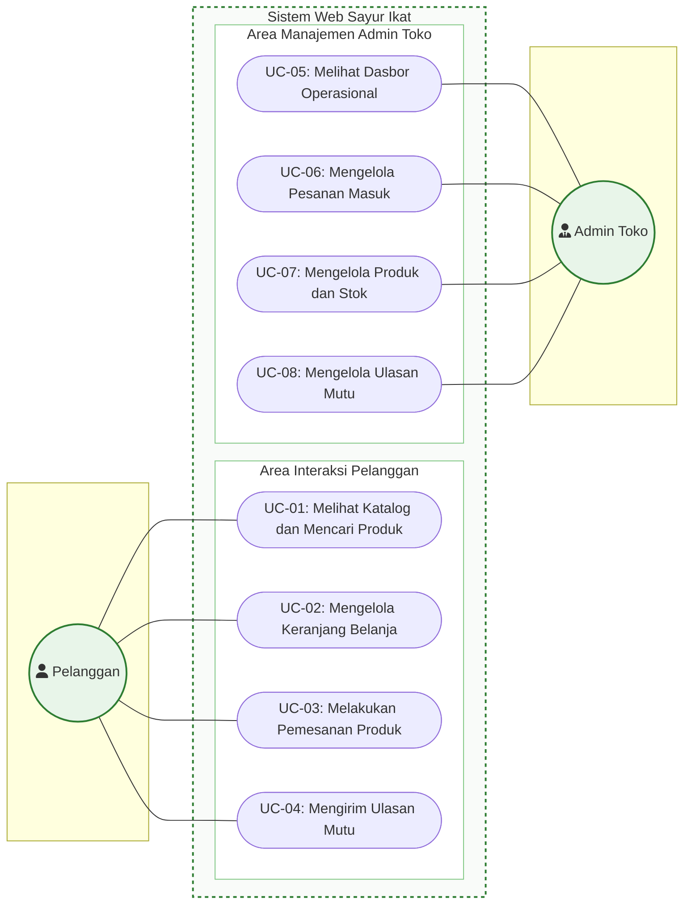

# 3. DESKRIPSI RINCI PERANGKAT LUNAK

## 3.2 Pemodelan Analisis

### 3.2.1 Use Case Diagram

*Use Case Diagram* menyajikan representasi visual mengenai interaksi antara aktor di luar sistem dengan fungsionalitas yang disediakan di dalam batasan (*system boundary*) perangkat lunak **Sayur Ikat**. Diagram ini diturunkan secara langsung dari Kebutuhan Fungsional (Subbab 3.1.1) dan mengacu pada profil pengguna (Subbab 2.3).

---

#### A. Tabel Pemetaan: Aktor $\rightarrow$ Kebutuhan Fungsional $\rightarrow$ Use Case

| No. | Aktor (Subbab 2.3) | Kode FR (Subbab 3.1.1) | ID Use Case | Nama Use Case (Kata Kerja) | Deskripsi Singkat Fungsionalitas |
| :-: | :--- | :--- | :---: | :--- | :--- |
| 1. | **Pelanggan** | FR-CAT-01, FR-CAT-02 | `UC-01` | **Melihat Katalog dan Mencari Produk** | Menjelajahi daftar komoditas sayur organik, memfilter berdasarkan kategori, dan mencari produk berdasarkan nama. |
| 2. | **Pelanggan** | FR-CART-01, FR-CART-02 | `UC-02` | **Mengelola Keranjang Belanja** | Memasukkan produk ke keranjang, menambah/mengurangi kuantitas, menghapus item, dan melihat kalkulasi ongkos kirim. |
| 3. | **Pelanggan** | FR-ORDR-01, FR-ORDR-02, FR-ORDR-03, FR-ORDR-04 | `UC-03` | **Melakukan Pemesanan Produk** | Mengisi data pemesan (*guest checkout*), memilih metode bayar (COD/QRIS/Transfer), dan mengirim pesanan ke database & WhatsApp. |
| 4. | **Pelanggan** | FR-FEED-01, FR-FEED-02 | `UC-04` | **Mengirim Ulasan Mutu** | Memberikan penilaian 4 aspek kualitas, mengunggah bukti foto sayur rusak ($\le$ 5 MB), dan mengirim feedback. |
| 5. | **Admin Toko** | FR-ADM-01 | `UC-05` | **Melihat Dasbor Operasional** | Memantau ringkasan statistik harian: jumlah pesanan masuk, total pendapatan, komoditas berstok kritis, dan transaksi terbaru. |
| 6. | **Admin Toko** | FR-ADM-02 | `UC-06` | **Mengelola Pesanan Masuk** | Memeriksa rincian pesanan masuk, memfilter status, memperbarui status pengiriman (`PENDING` $\rightarrow$ `SELESAI`), dan menghubungi pemesan. |
| 7. | **Admin Toko** | FR-ADM-03 | `UC-07` | **Mengelola Produk dan Stok** | Menambah varian sayur baru, memperbarui informasi produk/harga, serta mengubah stok fisik harian secara manual/toggle. |
| 8. | **Admin Toko** | FR-ADM-04 | `UC-08` | **Mengelola Ulasan Mutu** | Meninjau evaluasi mutu dan foto bukti kerusakan dari konsumen, serta menindaklanjuti keluhan melalui tautan WhatsApp. |

---

#### B. Visualisasi Use Case Diagram (Format Mermaid)



---

#### C. Representasi Tekstual / Diagram Batasan Sistem (Siap Salin ke Dokumen)

```text
+-------------------------------------------------------------------------------------------------------+
|                                         SISTEM WEB SAYUR IKAT                                         |
|                                                                                                       |
|    [ AKTOR ]                                                                             [ AKTOR ]    |
|                                                                                                       |
|   +-----------+                                                                        +------------+ |
|   |           | --------> ( UC-01: Melihat Katalog dan Mencari Produk )                |            | |
|   |           |                                                                        |            | |
|   |           | --------> ( UC-02: Mengelola Keranjang Belanja )                       |            | |
|   |           |                                                                        |            | |
|   | PELANGGAN | --------> ( UC-03: Melakukan Pemesanan Produk )                        | ADMIN TOKO | |
|   |           |                                                                        |            | |
|   |           | --------> ( UC-04: Mengirim Ulasan Mutu )                              |            | |
|   |           |                                                                        |            | |
|   |           |             ( UC-05: Melihat Dasbor Operasional ) <------------------- |            | |
|   |           |                                                                        |            | |
|   |           |             ( UC-06: Mengelola Pesanan Masuk ) <---------------------- |            | |
|   |           |                                                                        |            | |
|   |           |             ( UC-07: Mengelola Produk dan Stok ) <-------------------- |            | |
|   |           |                                                                        |            | |
|   |           |             ( UC-08: Mengelola Ulasan Mutu ) <------------------------ |            | |
|   +-----------+                                                                        +------------+ |
|                                                                                                       |
+-------------------------------------------------------------------------------------------------------+
```

---

#### D. Verifikasi Kepatuhan Syarat Rekayasa Perangkat Lunak

1. **Semua Aktor Terdefinisi di 2.3**: Diagram hanya memuat 2 aktor yaitu **Pelanggan** dan **Admin Toko**, tepat sama dengan tabel profil pengguna pada Subbab 2.3 tanpa memunculkan aktor kurir atau penjual eksternal.
2. **Semua Use Case Berasal dari Kebutuhan Fungsional**: Setiap *use case* (`UC-01` s.d. `UC-08`) diturunkan langsung dan terhubung ke kode kebutuhan fungsional `FR-CAT-01` sampai dengan `FR-ADM-04` pada Subbab 3.1.1.
3. **Nama Use Case Menggunakan Kata Kerja**: Seluruh judul *use case* diawali kata kerja transitif aktif (*Melihat*, *Mengelola*, *Melakukan*, *Mengirim*).
4. **Posisi Aktor dan Boundary**: Aktor berada di luar kotak batasan sistem (*boundary*), sedangkan seluruh *use case* berada di dalam kotak batasan sistem.
5. **Nama Sistem Jelas**: Batasan sistem bertuliskan secara eksplisit **"Sistem Web Sayur Ikat"**.
6. **Tidak Ada Fungsi di Luar Scope**: Tidak memuat fungsionalitas yang berada di luar ruang lingkup (seperti autentikasi login pembeli, *live GPS tracking*, maupun *payment gateway* pihak ketiga).
7. **Tidak Ada Use Case yang Berlebihan / Mubazir**: Setiap *use case* merepresentasikan satu unit interaksi bernilai fungsional utuh (*end-to-end*).
